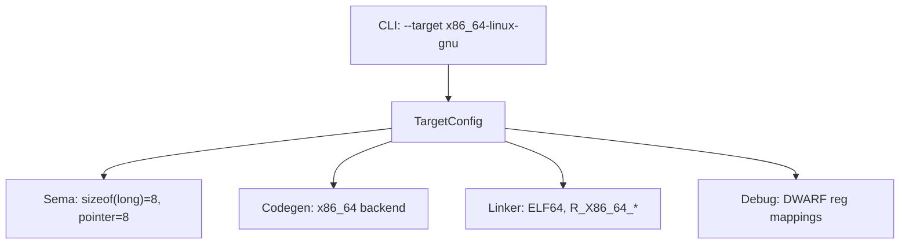

# Technical Specification

# 0. Agent Action Plan

## 0.1 Intent Clarification

### 0.1.1 Core Feature Objective

Based on the prompt, the Blitzy platform understands that the new feature requirement is to build a **complete, self-contained C compiler written in pure Rust** targeting Linux ELF output across four processor architectures, with an integrated preprocessor, assembler, and linker — requiring zero external toolchain invocations and zero crates beyond the Rust standard library.

The specific feature requirements are:

- **Complete C11 Compiler Frontend** — Implement a full C11-standard-compliant parser, lexer, preprocessor, and semantic analyzer, extended with GCC language extensions including `__attribute__`, `__builtin_*` intrinsics, inline assembly with operand constraints, statement expressions, `typeof`/`__typeof__`, computed goto, and `__extension__`
- **Four-Architecture Code Generation** — Generate native machine code for x86-64, i686, AArch64, and RISC-V 64 through an integrated assembler that directly encodes machine instructions for all four targets without reliance on external `as` or `gas`
- **Integrated ELF Linker** — Produce ELF executables and shared libraries by reading ELF relocatable objects and `ar` static archives for system CRT and library linkage, without reliance on external `ld`, `lld`, or `gold`
- **Multi-Format ELF Output** — Emit ELF64 for x86-64, AArch64, and RISC-V 64 targets, and ELF32 for i686, supporting static executables (default), shared libraries (`-shared` + `-fPIC`), and relocatable objects (`-c`)
- **DWARF v4 Debug Information** — Generate DWARF version 4 debug sections when the `-g` flag is specified, with sufficient fidelity for source-level debugging in `gdb` and `lldb`
- **x86-64 Security Hardening** — Implement retpoline sequences via `-mretpoline`, Intel CET `endbr64` instrumentation via `-fcf-protection`, and automatic stack probing for stack frames exceeding one page
- **Bundled Freestanding Headers** — Ship nine freestanding C standard headers (`stddef.h`, `stdint.h`, `stdarg.h`, `stdbool.h`, `limits.h`, `float.h`, `stdalign.h`, `stdnoreturn.h`, `iso646.h`) enabling compilation without external header dependencies
- **Optimization Pipeline** — Implement optimization levels `-O0` through `-O2` with architecture, IR design, pass selection, and optimization strategy at the system's discretion
- **GCC-Compatible CLI** — Support the standard GCC-compatible command-line flags: `-c`, `-o`, `-I`, `-D`, `-U`, `-L`, `-l`, `-g`, `-O[012]`, `-shared`, `-fPIC`, `-mretpoline`, `-fcf-protection`, `-static`, `--target`
- **GCC-Compatible Diagnostics** — Emit error messages in GCC-compatible diagnostic format on stderr with exit code 1 on any compile error

Implicit requirements detected:

- **Per-Architecture ABI Compliance** — Each backend must implement its target's standard calling convention: System V AMD64 ABI for x86-64, cdecl/System V i386 ABI for i686, AAPCS64 for AArch64, and LP64D for RISC-V 64
- **ELF Dual-Width Support** — The ELF generator and linker must handle both 32-bit and 64-bit ELF structures, with appropriate header formats, relocation types, and section layouts per target
- **Relocation Type Coverage** — Each architecture backend must emit and process its own set of ELF relocation types (e.g., `R_X86_64_*`, `R_386_*`, `R_AARCH64_*`, `R_RISCV_*`)
- **Cross-Architecture Target Selection at Runtime** — The `--target` flag implies dynamic selection of code generator, assembler, linker configuration, and ABI at compile time based on the specified target triple
- **CRT Object Linkage** — The integrated linker must locate and link system CRT startup objects (`crt1.o`, `crti.o`, `crtn.o`) and C standard library archives from the target system
- **Position-Independent Code Generation** — The `-fPIC` flag requires the code generator to emit position-independent sequences for all four architectures (GOT-relative addressing, PLT stubs, etc.)

### 0.1.2 Special Instructions and Constraints

**Zero-Dependency Architecture** — The compiler must use exclusively the Rust standard library (`std`). Every `[dependencies]` section in `Cargo.toml` must remain empty. This follows the zero-dependency principle established by the reference implementation (`anthropics/claudes-c-compiler`).

**Unsafe Code Policy** — Every `unsafe` block must carry an inline comment that justifies the invariant, explains why a safe abstraction is insufficient, and documents the scope of the unsafe region. User Example:
```
// SAFETY: We need to write ELF header bytes directly. Raw pointer
// write is required because std::io::Write adds buffering overhead
// incompatible with our section-aligned output. Scope: single write
// of a fixed-size header struct to a pre-allocated Vec<u8>.
```

**Performance Constraints** — The compiler must compile the SQLite amalgamation (~230K lines of C) in under 60 seconds on a single core at `-O0`, with peak resident set size not exceeding 2 GB during that compilation.

**Backward Compatibility with Tech Spec** — While the user's requirements significantly expand beyond the tech spec's documented scope, the existing tech spec architecture (three-tier pipeline: Frontend → Middle-End → Backend) and module organization principles remain valid and should be preserved. The expansion adds new modules and capabilities rather than replacing the existing design.

**Reference Implementation Alignment** — The architecture should align with the reference implementation `anthropics/claudes-c-compiler` (~186K lines of Rust), which successfully demonstrated a zero-dependency, four-architecture C compiler that compiled the Linux 6.9 kernel.

### 0.1.3 Technical Interpretation

These feature requirements translate to the following technical implementation strategy:

- To **implement the C11 frontend with GCC extensions**, we will create a complete `src/frontend/` module tree containing a preprocessor (with macro expansion, conditional compilation, include resolution, and expression evaluation), a lexer (recognizing all C11 keywords plus GCC extension tokens), and a recursive-descent parser producing a richly typed AST that accommodates GCC extension nodes such as `__attribute__` annotations, statement expressions, `typeof` specifiers, inline assembly blocks, and computed goto targets
- To **generate code for four architectures**, we will create four parallel backend modules under `src/codegen/` — `x86_64/`, `i686/`, `aarch64/`, and `riscv64/` — each implementing a common `CodeGen` trait with architecture-specific instruction selection, machine code encoding (integrated assembler), ABI handling, and register allocation
- To **produce ELF output without external tools**, we will create a `src/linker/` module that reads ELF relocatable objects and `ar` archives, resolves symbols across compilation units and CRT objects, applies architecture-specific relocations, merges sections, and emits complete ELF32 or ELF64 binaries with proper program headers for executables and shared libraries
- To **emit DWARF v4 debug information**, we will create a `src/debug/` module that generates `.debug_info`, `.debug_abbrev`, `.debug_line`, `.debug_str`, `.debug_aranges`, `.debug_frame`, and `.debug_loc` ELF sections with compilation unit DIEs, subprogram DIEs, variable DIEs, type DIEs, and line number programs sufficient for `gdb`/`lldb` source-level debugging
- To **implement x86-64 security hardening**, we will extend the `src/codegen/x86_64/` module with a dedicated `security.rs` that generates retpoline thunk sequences for indirect calls/jumps (replacing `jmp *%rax` with retpoline), inserts `endbr64` instructions at all indirect branch targets for CET compatibility, and emits stack probes (`__chkstk`-equivalent sequences) when stack frames exceed 4096 bytes
- To **ship bundled freestanding headers**, we will embed nine C header files in the `include/` directory at the repository root, containing target-architecture-adaptive type definitions (e.g., `stdint.h` defines `int32_t` as 4 bytes across all targets) that the preprocessor resolves via an implicit include path
- To **validate against real-world codebases**, we will create an automated test harness that fetches SQLite, Lua, zlib, and Redis source trees, compiles them for all four architectures, runs test suites via QEMU user-mode emulation for non-native targets, and verifies security hardening via disassembly inspection

## 0.2 Repository Scope Discovery

### 0.2.1 Comprehensive File Analysis

The repository is a **greenfield project** containing only `README.md`. Every source file, test file, configuration file, and documentation artifact must be created from scratch. The following exhaustive inventory covers every file and directory that the implementation must produce.

**Existing Files to Modify**

| File | Modification Required |
|---|---|
| `README.md` | Rewrite with comprehensive project documentation: build instructions, usage examples, architecture overview, supported targets, CLI flags, and validation suite instructions |

**Driver and Entry Point — `src/driver/**/*.rs`, `src/main.rs`**

| File | Purpose |
|---|---|
| `src/main.rs` | Binary entry point; parses CLI arguments, selects target, orchestrates pipeline, returns exit code |
| `src/driver/mod.rs` | Driver module exports; pipeline orchestration coordinating all compilation phases F-001 through F-008 |
| `src/driver/cli.rs` | GCC-compatible CLI argument parsing for `-c`, `-o`, `-I`, `-D`, `-U`, `-L`, `-l`, `-g`, `-O[012]`, `-shared`, `-fPIC`, `-mretpoline`, `-fcf-protection`, `-static`, `--target` |
| `src/driver/target.rs` | Target triple parsing and configuration; maps `--target` values to architecture-specific ABI, ELF format, and code generator selection |
| `src/driver/pipeline.rs` | Compilation pipeline sequencing: preprocessor → lexer → parser → semantic analysis → IR generation → optimization → code generation → linking |

**Frontend — `src/frontend/**/*.rs`**

| File | Purpose |
|---|---|
| `src/frontend/mod.rs` | Frontend module exports aggregating preprocessor, lexer, and parser |
| `src/frontend/preprocessor/mod.rs` | Preprocessor entry point; coordinates directive processing, macro expansion, and include resolution |
| `src/frontend/preprocessor/directives.rs` | `#include`, `#define`, `#undef`, `#pragma`, `#error`, `#warning`, `#line` directive handling |
| `src/frontend/preprocessor/macros.rs` | Object-like and function-like macro expansion with stringification (`#`) and token pasting (`##`) |
| `src/frontend/preprocessor/conditional.rs` | `#ifdef`, `#ifndef`, `#if`, `#elif`, `#else`, `#endif` conditional compilation evaluation |
| `src/frontend/preprocessor/expression.rs` | Preprocessor constant expression evaluator for `#if` directives (integer arithmetic, `defined()`) |
| `src/frontend/preprocessor/include.rs` | Include path resolution against `-I` directories and bundled header paths |
| `src/frontend/lexer/mod.rs` | Lexer entry point; tokenizes preprocessed source into a token stream |
| `src/frontend/lexer/token.rs` | Token type enum and token struct definitions (keyword, identifier, literal, operator, punctuation) |
| `src/frontend/lexer/keywords.rs` | C11 keyword table plus GCC extension keywords (`__attribute__`, `__builtin_*`, `__asm__`, `typeof`, `__typeof__`, `__extension__`) |
| `src/frontend/lexer/literals.rs` | Numeric literal parsing (decimal, hex, octal, binary, float), string/character literal parsing with escape sequences |
| `src/frontend/lexer/source.rs` | Source position tracking: file path, line number, column offset, byte offset for each token |
| `src/frontend/parser/mod.rs` | Recursive-descent parser entry point; produces a complete AST from the token stream |
| `src/frontend/parser/ast.rs` | AST node type definitions for all C11 constructs plus GCC extensions |
| `src/frontend/parser/declarations.rs` | Declaration parsing: variable, function, typedef, struct/union/enum forward declarations |
| `src/frontend/parser/expressions.rs` | Expression parsing with C operator precedence and associativity (Pratt parsing or precedence climbing) |
| `src/frontend/parser/statements.rs` | Statement parsing: if/else, for, while, do-while, switch/case, break, continue, return, goto, labeled |
| `src/frontend/parser/types.rs` | Type specifier parsing: struct, union, enum, typedef names, qualifiers, array declarators, function pointers |
| `src/frontend/parser/gcc_extensions.rs` | GCC extension parsing: `__attribute__((...))`, statement expressions `({...})`, `typeof`/`__typeof__`, computed goto `&&label`, inline assembly, `__extension__` |

**Semantic Analysis — `src/sema/**/*.rs`**

| File | Purpose |
|---|---|
| `src/sema/mod.rs` | Semantic analysis entry point; type checking, scope resolution, symbol table management |
| `src/sema/type_check.rs` | Type checking for all expressions, assignments, function calls, and return statements |
| `src/sema/type_conversion.rs` | Implicit type conversion rules: integer promotions, usual arithmetic conversions, pointer conversions |
| `src/sema/scope.rs` | Lexical scope management: block scope, function scope, file scope, prototype scope |
| `src/sema/symbol_table.rs` | Scope-aware symbol table with declaration registration, lookup, and redeclaration conflict detection |
| `src/sema/storage.rs` | Storage class specifier validation: `static`, `extern`, `auto`, `register`, `_Thread_local` |
| `src/sema/types.rs` | Type representation: scalar types, composite types, pointer types, array types, function types with size/alignment computation per target architecture |

**Intermediate Representation — `src/ir/**/*.rs`**

| File | Purpose |
|---|---|
| `src/ir/mod.rs` | IR module exports; defines the target-independent intermediate representation |
| `src/ir/types.rs` | IR type system mapping C types to IR-level representations with target-specific sizes |
| `src/ir/instructions.rs` | IR instruction set definition: arithmetic, comparison, memory, control flow, call, phi nodes |
| `src/ir/builder.rs` | IR builder translating typed AST nodes into IR instruction sequences |
| `src/ir/cfg.rs` | Control flow graph construction: basic blocks, edges, dominance, loop detection |
| `src/ir/ssa.rs` | SSA construction: phi node insertion, variable renaming, dominance frontier computation |

**Optimization Passes — `src/passes/**/*.rs`**

| File | Purpose |
|---|---|
| `src/passes/mod.rs` | Pass manager coordinating optimization pass execution per `-O` level |
| `src/passes/constant_fold.rs` | Constant folding: compile-time evaluation of arithmetic on known constants |
| `src/passes/dce.rs` | Dead code elimination: removal of unreachable blocks and unused computations |
| `src/passes/cse.rs` | Common subexpression elimination: detecting and reusing repeated computations |
| `src/passes/simplify.rs` | Algebraic simplification and strength reduction (e.g., multiply by power-of-two to shift) |
| `src/passes/mem2reg.rs` | Memory-to-register promotion: converting stack allocations to SSA virtual registers |
| `src/passes/pipeline.rs` | Pass pipeline definitions for `-O0` (no optimization), `-O1` (basic), `-O2` (aggressive) |

**Code Generation Backends — `src/codegen/**/*.rs`**

| File | Purpose |
|---|---|
| `src/codegen/mod.rs` | `CodeGen` trait definition, target backend dispatch, shared code generation utilities |
| `src/codegen/regalloc.rs` | Register allocator shared across all backends (linear scan or graph coloring) |
| `src/codegen/x86_64/mod.rs` | x86-64 backend entry point implementing `CodeGen` trait |
| `src/codegen/x86_64/isel.rs` | x86-64 instruction selection: IR instructions to x86-64 machine instructions |
| `src/codegen/x86_64/encoding.rs` | x86-64 integrated assembler: machine instruction encoding to bytes (REX prefixes, ModR/M, SIB, immediates) |
| `src/codegen/x86_64/abi.rs` | System V AMD64 ABI: register argument passing (rdi, rsi, rdx, rcx, r8, r9), stack frame layout, return value conventions |
| `src/codegen/x86_64/security.rs` | Security hardening: retpoline thunks (`-mretpoline`), CET `endbr64` instrumentation (`-fcf-protection`), stack probing for frames >4096 bytes |
| `src/codegen/i686/mod.rs` | i686 backend entry point implementing `CodeGen` trait |
| `src/codegen/i686/isel.rs` | i686 instruction selection: IR instructions to 32-bit x86 machine instructions |
| `src/codegen/i686/encoding.rs` | i686 integrated assembler: 32-bit x86 instruction encoding (no REX, 32-bit addressing modes) |
| `src/codegen/i686/abi.rs` | System V i386 cdecl ABI: stack-based argument passing, caller cleanup, eax/edx return |
| `src/codegen/aarch64/mod.rs` | AArch64 backend entry point implementing `CodeGen` trait |
| `src/codegen/aarch64/isel.rs` | AArch64 instruction selection: IR instructions to A64 machine instructions |
| `src/codegen/aarch64/encoding.rs` | AArch64 integrated assembler: fixed-width 32-bit instruction encoding |
| `src/codegen/aarch64/abi.rs` | AAPCS64 ABI: x0-x7 argument registers, v0-v7 float registers, stack frame layout |
| `src/codegen/riscv64/mod.rs` | RISC-V 64 backend entry point implementing `CodeGen` trait |
| `src/codegen/riscv64/isel.rs` | RISC-V 64 instruction selection: IR instructions to RV64GC machine instructions |
| `src/codegen/riscv64/encoding.rs` | RISC-V 64 integrated assembler: variable-length instruction encoding (32-bit base, 16-bit compressed) |
| `src/codegen/riscv64/abi.rs` | RISC-V LP64D ABI: a0-a7 argument registers, fa0-fa7 float registers, stack frame layout |

**Integrated Linker — `src/linker/**/*.rs`**

| File | Purpose |
|---|---|
| `src/linker/mod.rs` | Linker entry point: orchestrates object reading, symbol resolution, relocation, and ELF output |
| `src/linker/elf.rs` | ELF format structures: ELF32/ELF64 headers, section headers, program headers, reading and writing |
| `src/linker/archive.rs` | `ar` static archive reader: parses archive headers, extracts member ELF objects |
| `src/linker/relocations.rs` | Relocation processing for all four architectures (`R_X86_64_*`, `R_386_*`, `R_AARCH64_*`, `R_RISCV_*`) |
| `src/linker/sections.rs` | Section merging, ordering, and layout computation for `.text`, `.data`, `.bss`, `.rodata`, etc. |
| `src/linker/symbols.rs` | Symbol resolution across compilation units, CRT objects, and library archives |
| `src/linker/dynamic.rs` | Shared library support: `.dynamic` section, `.dynsym`, `.dynstr`, PLT/GOT generation for `-shared` output |
| `src/linker/script.rs` | Default linker script behavior: section-to-segment mapping, entry point selection, memory layout |

**Debug Information — `src/debug/**/*.rs`**

| File | Purpose |
|---|---|
| `src/debug/mod.rs` | Debug info generation entry point; coordinates DWARF section emission |
| `src/debug/dwarf.rs` | DWARF v4 core structures: compilation unit headers, DIE tree construction, abbreviation tables |
| `src/debug/line_program.rs` | `.debug_line` section: line number program state machine encoding source-to-address mappings |
| `src/debug/info.rs` | `.debug_info` section: subprogram DIEs, variable DIEs, type DIEs, scope DIEs |
| `src/debug/frame.rs` | `.debug_frame` section: Call Frame Information (CFI) for stack unwinding |

**Common Utilities — `src/common/**/*.rs`**

| File | Purpose |
|---|---|
| `src/common/mod.rs` | Common types and utilities shared across all compiler phases |
| `src/common/diagnostics.rs` | GCC-compatible error/warning/note reporting: `file:line:col: error: message` format on stderr |
| `src/common/source_map.rs` | Source file registry and position tracking across preprocessor expansions |
| `src/common/intern.rs` | String interning for identifiers, keywords, and string literals to reduce memory usage |
| `src/common/arena.rs` | Arena allocator for AST and IR nodes to minimize allocation overhead and improve cache locality |
| `src/common/numeric.rs` | Numeric constant representation: arbitrary-precision integers for compile-time evaluation |

**Bundled Freestanding Headers — `include/**/*.h`**

| File | Purpose |
|---|---|
| `include/stddef.h` | `size_t`, `ptrdiff_t`, `NULL`, `offsetof`, `max_align_t` — target-width-adaptive |
| `include/stdint.h` | Fixed-width integer types (`int8_t` through `int64_t`, `uintptr_t`, etc.) with target-specific definitions |
| `include/stdarg.h` | `va_list`, `va_start`, `va_arg`, `va_end`, `va_copy` — implemented via compiler builtins |
| `include/stdbool.h` | `bool`, `true`, `false` macro definitions |
| `include/limits.h` | Integer limits (`INT_MAX`, `LONG_MAX`, etc.) — target-width-adaptive for 32-bit vs 64-bit |
| `include/float.h` | Floating-point characteristics (`FLT_MAX`, `DBL_EPSILON`, etc.) per IEEE 754 |
| `include/stdalign.h` | `alignas`, `alignof` macro definitions mapping to C11 `_Alignas`/`_Alignof` |
| `include/stdnoreturn.h` | `noreturn` macro mapping to C11 `_Noreturn` |
| `include/iso646.h` | Alternative operator spellings: `and`, `or`, `not`, `xor`, `bitand`, `bitor`, `compl`, etc. |

**Build Configuration**

| File | Purpose |
|---|---|
| `Cargo.toml` | Package manifest: `name = "bcc"`, `edition = "2021"`, zero dependencies, release profile `opt-level = 3` |
| `Cargo.lock` | Auto-generated dependency lock file (empty dependency tree) |
| `build.rs` | Build script embedding bundled headers into the binary or resolving header installation path |
| `.gitignore` | Standard Rust `.gitignore` for `/target`, `Cargo.lock` (optional), IDE files |

**Testing — `tests/**/*.rs`**

| File | Purpose |
|---|---|
| `tests/common/mod.rs` | Shared test utilities: compile helper, run helper, assertion macros, temp directory management |
| `tests/preprocessing.rs` | Integration tests for preprocessor: `#include`, `#define`, `#if`, macro expansion, stringification |
| `tests/lexing.rs` | Integration tests for lexer: keyword recognition, literal parsing, operator tokenization |
| `tests/parsing.rs` | Integration tests for parser: declarations, expressions, statements, struct/union/enum, GCC extensions |
| `tests/semantic.rs` | Integration tests for semantic analysis: type checking, scope resolution, implicit conversions |
| `tests/codegen_x86_64.rs` | Code generation tests for x86-64 backend: instruction selection, ABI compliance, register allocation |
| `tests/codegen_i686.rs` | Code generation tests for i686 backend |
| `tests/codegen_aarch64.rs` | Code generation tests for AArch64 backend |
| `tests/codegen_riscv64.rs` | Code generation tests for RISC-V 64 backend |
| `tests/linking.rs` | Integration tests for linker: ELF generation, symbol resolution, CRT linkage, ar archive reading |
| `tests/dwarf.rs` | Integration tests for DWARF v4 debug info: `.debug_info`, `.debug_line`, GDB/LLDB compatibility |
| `tests/security.rs` | Integration tests for security hardening: retpoline verification, `endbr64` verification, stack probing |
| `tests/optimization.rs` | Integration tests for optimization passes: constant folding, DCE, CSE at each `-O` level |
| `tests/cli.rs` | CLI integration tests: flag parsing, error exit codes, output file naming |
| `tests/multiarch.rs` | Cross-architecture integration tests: hello world on all four targets via QEMU |
| `tests/hello_world.rs` | End-to-end smoke test: compile and execute hello world on all four architectures |

**Validation Suite — `tests/validation/**/*.rs`**

| File | Purpose |
|---|---|
| `tests/validation/mod.rs` | Validation suite coordinator: source fetching, compilation, test execution, result reporting |
| `tests/validation/sqlite.rs` | SQLite amalgamation: compile, run test suite, verify performance constraints (<60s, <2GB RSS) |
| `tests/validation/lua.rs` | Lua source: compile and run bundled test suite |
| `tests/validation/zlib.rs` | zlib source: compile and run bundled test suite |
| `tests/validation/redis.rs` | Redis source: compile-only verification (no test suite execution) |

**Documentation — `docs/**/*.md`**

| File | Purpose |
|---|---|
| `docs/architecture.md` | Compiler architecture overview: pipeline stages, module relationships, data flow |
| `docs/targets.md` | Supported target architectures: ABI details, ELF format specifics, QEMU testing |
| `docs/cli.md` | Complete CLI reference: all supported flags with descriptions and examples |
| `docs/internals/ir.md` | IR design documentation: instruction set, type system, SSA form |
| `docs/internals/linker.md` | Linker internals: ELF format handling, relocation processing, CRT linkage |
| `docs/internals/dwarf.md` | DWARF v4 implementation notes: section layouts, DIE schemas, line program encoding |

**CI/CD — `.github/workflows/**/*.yml`**

| File | Purpose |
|---|---|
| `.github/workflows/ci.yml` | CI pipeline: build, unit tests, integration tests, clippy lint, rustfmt check |
| `.github/workflows/validation.yml` | Validation pipeline: fetch test targets, compile SQLite/Lua/zlib/Redis, run test suites |

### 0.2.2 Web Search Research Conducted

- **Rust stable toolchain version** — Confirmed Rust 1.93.1 as the current stable release; Rust 2021 edition remains fully supported on this version and will be used per the tech spec's constraint (TC-001)
- **DWARF v4 specification structure** — Researched the DWARF Debugging Information Format Version 4 standard: ELF sections include `.debug_info`, `.debug_abbrev`, `.debug_line`, `.debug_str`, `.debug_aranges`, `.debug_frame`, `.debug_loc`; data is organized as Compilation Unit headers followed by DIE trees; line number information uses a state machine encoding with standard, extended, and special opcodes
- **ELF format and relocation types** — Confirmed ELF32 for i686 and ELF64 for x86-64/AArch64/RISC-V 64; each architecture has distinct relocation type sets
- **Reference implementation** — `anthropics/claudes-c-compiler` (~186K lines of Rust) validated the zero-dependency, four-architecture approach and successfully compiled the Linux 6.9 kernel

### 0.2.3 New File Requirements

Since this is a greenfield repository, **all files listed in Section 0.2.1 are new creations**. The total file count is approximately:

| Category | Count | Pattern |
|---|---|---|
| Driver/Entry | 5 | `src/main.rs`, `src/driver/**/*.rs` |
| Frontend | 17 | `src/frontend/**/*.rs` |
| Semantic Analysis | 7 | `src/sema/**/*.rs` |
| Intermediate Representation | 6 | `src/ir/**/*.rs` |
| Optimization Passes | 7 | `src/passes/**/*.rs` |
| Code Generation (4 backends) | 17 | `src/codegen/**/*.rs` |
| Integrated Linker | 8 | `src/linker/**/*.rs` |
| Debug Information | 5 | `src/debug/**/*.rs` |
| Common Utilities | 6 | `src/common/**/*.rs` |
| Bundled Headers | 9 | `include/**/*.h` |
| Build Configuration | 4 | `Cargo.toml`, `build.rs`, `.gitignore`, `Cargo.lock` |
| Integration Tests | 16 | `tests/**/*.rs` |
| Validation Suite | 5 | `tests/validation/**/*.rs` |
| Documentation | 7 | `README.md`, `docs/**/*.md` |
| CI/CD | 2 | `.github/workflows/**/*.yml` |
| **Total** | **~121** | |

## 0.3 Dependency Inventory

### 0.3.1 Private and Public Packages

The compiler enforces a **strict zero-external-dependency architecture**. The only dependency is the Rust standard library itself. No private packages, no crate dependencies, and no third-party libraries of any kind are permitted.

**Compiler Build Dependencies**

| Registry | Package | Version | Purpose |
|---|---|---|---|
| Rust Toolchain | `rustc` | 1.93.1 (stable) | Rust compiler for building the `bcc` binary |
| Rust Toolchain | `cargo` | 1.93.1 | Build system and package manager |
| Rust Toolchain | `std` (standard library) | Bundled with rustc 1.93.1 | The sole runtime dependency; provides `std::io`, `std::fs`, `std::collections`, `std::env`, `std::process`, `std::fmt`, `std::path`, `std::alloc` |
| Crates.io | *(none)* | — | Zero external crates per constraint C-003 |

**Rust `std` Library Modules Utilized**

| `std` Module | Usage in Compiler |
|---|---|
| `std::io` | File I/O for reading source files, writing ELF output, stderr diagnostics |
| `std::fs` | File system operations: reading source, locating headers, locating CRT objects |
| `std::path` | Path manipulation for include resolution, `-I`/`-L` directory handling |
| `std::collections` | `HashMap` for symbol tables and interning; `BTreeMap` for ordered section layout; `Vec` for token streams, AST nodes, IR instructions; `VecDeque` for work lists |
| `std::env` | Command-line argument access, environment variable inspection |
| `std::process` | Exit code management; child process execution for validation test harness |
| `std::fmt` | Diagnostic message formatting |
| `std::alloc` | Custom allocator integration for arena allocation |
| `std::mem` | Size/alignment computation for C type layout; `transmute` for raw byte manipulation in ELF emission |
| `std::ptr` | Raw pointer operations for machine code buffer construction (with documented `unsafe` blocks) |
| `std::num` | `NonZeroU*` types for compact option representations; `Wrapping` for C integer semantics |
| `std::cell` | `RefCell` for interior mutability in diagnostic accumulation |
| `std::rc` / `std::sync::Arc` | Reference counting for shared AST/IR node references |

**Validation/Testing System Dependencies**

| Registry | Package | Version | Purpose |
|---|---|---|---|
| System (apt) | `qemu-user-static` | System package | QEMU user-mode emulation for running i686, AArch64, RISC-V 64 binaries on x86-64 host |
| System (apt) | `libc6-dev` | System package | System CRT objects (`crt1.o`, `crti.o`, `crtn.o`) and `libc.a`/`libc.so` for native x86-64 linking |
| System (apt) | `libc6-dev-i386` or `libc6-dev-i386-cross` | System package | 32-bit CRT and libc for i686 target |
| System (apt) | `libc6-dev-arm64-cross` | System package | AArch64 CRT and libc for cross-compilation linking |
| System (apt) | `libc6-dev-riscv64-cross` | System package | RISC-V 64 CRT and libc for cross-compilation linking |
| External Source | SQLite amalgamation | Latest stable | Validation target: ~230K LOC, compile + test suite |
| External Source | Lua | Latest stable | Validation target: compile + test suite |
| External Source | zlib | Latest stable | Validation target: compile + test suite |
| External Source | Redis | Latest stable | Validation target: compile-only |

### 0.3.2 Dependency Updates

Since this is a greenfield project, there are no existing imports or references to update. All module imports will be established fresh during implementation.

**Internal Module Import Architecture**

The import graph follows the pipeline's strict sequential dependency chain. Each phase imports from the preceding phase's output types and from the shared `common` module:

| Importing Module | Imports From | Key Types Imported |
|---|---|---|
| `src/driver/**` | `frontend`, `sema`, `ir`, `passes`, `codegen`, `linker`, `debug`, `common` | All pipeline phase entry points |
| `src/frontend/lexer/**` | `common` | `SourceLocation`, `Diagnostic`, `InternedString` |
| `src/frontend/preprocessor/**` | `frontend::lexer`, `common` | `Token`, `TokenStream`, `SourceMap` |
| `src/frontend/parser/**` | `frontend::lexer`, `common` | `Token`, `TokenStream`, AST node types |
| `src/sema/**` | `frontend::parser`, `common` | AST types, `SymbolTable`, `Type` |
| `src/ir/**` | `sema`, `common` | Typed AST, `Type`, `SymbolTable` |
| `src/passes/**` | `ir` | IR types, `Instruction`, `BasicBlock`, `CFG` |
| `src/codegen/**` | `ir`, `passes`, `common` | Optimized IR, target configuration |
| `src/linker/**` | `codegen`, `common` | Machine code bytes, relocation entries, symbol definitions |
| `src/debug/**` | `ir`, `codegen`, `common` | Source mappings, type info, symbol locations |
| `src/common/**` | `std` only | Foundation layer with no internal dependencies |

**External Reference Configuration**

| Configuration File | Key References |
|---|---|
| `Cargo.toml` | `edition = "2021"`, `[dependencies]` empty, `[profile.release] opt-level = 3` |
| `build.rs` | References `include/` directory for header embedding; sets `OUT_DIR` for generated constants |
| `.github/workflows/ci.yml` | References `cargo build`, `cargo test`, `cargo clippy`, `cargo fmt` |
| `.github/workflows/validation.yml` | References external source URLs for SQLite, Lua, zlib, Redis; references `qemu-user-static` |

## 0.4 Integration Analysis

### 0.4.1 Existing Code Touchpoints

As a greenfield project, there is no existing application code to modify. However, the compiler must integrate with several **external system components** at runtime, and internally the modules must interconnect through well-defined interfaces. This section documents all integration points.

**System-Level Integration Points**

| External Component | Integration Mechanism | Files Involved |
|---|---|---|
| Linux filesystem | `std::fs` for reading source files, locating CRT objects, writing output binaries | `src/driver/pipeline.rs`, `src/frontend/preprocessor/include.rs`, `src/linker/mod.rs` |
| System CRT objects | Linker reads `crt1.o`, `crti.o`, `crtn.o` from `/usr/lib/x86_64-linux-gnu/` (or cross-compilation sysroot equivalents) | `src/linker/mod.rs`, `src/linker/elf.rs`, `src/linker/symbols.rs` |
| System C library | Linker reads `libc.a` or `libc.so` from system library paths (`-L` directories) | `src/linker/archive.rs`, `src/linker/symbols.rs`, `src/linker/dynamic.rs` |
| Linux ELF loader | Output executables must conform to Linux ELF ABI for the kernel's `execve()` to load and execute them | `src/linker/elf.rs`, `src/linker/sections.rs`, `src/linker/script.rs` |
| Debuggers (GDB/LLDB) | DWARF v4 sections must be parseable by standard debugger implementations | `src/debug/**/*.rs` |
| QEMU user-mode | Validation binaries for non-native architectures execute via QEMU user-mode emulation | `tests/validation/**/*.rs`, `tests/multiarch.rs` |

**Internal Pipeline Integration Points**

The compiler pipeline is a strict sequential dependency chain where each phase produces output consumed by exactly one downstream phase. The critical integration interfaces are:

- **Preprocessor → Lexer** (`src/frontend/preprocessor/mod.rs` → `src/frontend/lexer/mod.rs`)
  - Interface: Preprocessed source text (`String`) with resolved includes, expanded macros, and evaluated conditionals
  - Contract: Output is syntactically valid C source ready for tokenization; all preprocessor directives have been consumed

- **Lexer → Parser** (`src/frontend/lexer/mod.rs` → `src/frontend/parser/mod.rs`)
  - Interface: `Vec<Token>` where each `Token` carries type, value, and `SourceLocation`
  - Contract: Every token is classified unambiguously; source positions are accurate through macro expansions

- **Parser → Semantic Analyzer** (`src/frontend/parser/mod.rs` → `src/sema/mod.rs`)
  - Interface: Untyped AST (`TranslationUnit` root node containing declarations, definitions, and type definitions)
  - Contract: AST is syntactically valid; source locations preserved on all nodes; GCC extension nodes represented

- **Semantic Analyzer → IR Generator** (`src/sema/mod.rs` → `src/ir/builder.rs`)
  - Interface: Typed AST with resolved symbols, type annotations, implicit conversion nodes, and populated symbol tables
  - Contract: Every expression has a resolved type; all identifiers are bound to declarations; type mismatches have been rejected

- **IR Generator → Optimizer** (`src/ir/builder.rs` → `src/passes/mod.rs`)
  - Interface: SSA-form IR with basic blocks, control flow edges, and phi nodes
  - Contract: IR preserves source program semantics; all IR values have types; CFG is well-formed

- **Optimizer → Code Generator** (`src/passes/pipeline.rs` → `src/codegen/mod.rs`)
  - Interface: Optimized IR (same IR types, but with passes applied according to `-O` level)
  - Contract: Optimized IR is semantically equivalent to input IR; dead code eliminated; constants folded

- **Code Generator → Linker** (`src/codegen/mod.rs` → `src/linker/mod.rs`)
  - Interface: Machine code byte sequences (`Vec<u8>`), relocation entries, symbol definitions, section assignments
  - Contract: Machine code is valid for the selected target; relocations correctly describe all unresolved references; symbols include binding and visibility attributes

- **Debug Info Generator → Linker** (`src/debug/mod.rs` → `src/linker/mod.rs`)
  - Interface: DWARF sections (`.debug_info`, `.debug_line`, `.debug_abbrev`, `.debug_str`, `.debug_frame`, `.debug_aranges`, `.debug_loc`) as byte vectors with associated relocations
  - Contract: DWARF data conforms to version 4 encoding; section cross-references use proper relocation entries

**Cross-Cutting Integration**

| Cross-Cutting Concern | Integrates With | Mechanism |
|---|---|---|
| Diagnostics (`src/common/diagnostics.rs`) | All pipeline phases | Every phase reports errors/warnings through a shared `DiagnosticEmitter` that formats GCC-compatible messages to stderr |
| Source Map (`src/common/source_map.rs`) | Preprocessor, Lexer, Parser, Debug | Tracks file inclusions, macro expansions, and line mappings; consumed by diagnostics and DWARF line programs |
| String Interning (`src/common/intern.rs`) | Lexer, Parser, Sema, Symbol Table | All identifier and string literal values interned at lexing time; subsequent phases reference interned handles |
| Target Configuration (`src/driver/target.rs`) | Sema (type sizes), Codegen (instruction sets), Linker (ELF format) | A `TargetConfig` struct propagated through the pipeline specifying pointer width, endianness, ABI, ELF class, and relocation type set |

**Target-Specific Data Flow**

The `--target` flag creates a branching point where target-specific parameters flow through the entire pipeline:



| Target | Pointer Size | `long` Size | ELF Class | Endianness | Register File |
|---|---|---|---|---|---|
| `x86_64-linux-gnu` | 8 bytes | 8 bytes | ELF64 | Little | rax-r15, xmm0-xmm15 |
| `i686-linux-gnu` | 4 bytes | 4 bytes | ELF32 | Little | eax-edi, xmm0-xmm7 |
| `aarch64-linux-gnu` | 8 bytes | 8 bytes | ELF64 | Little | x0-x30, v0-v31 |
| `riscv64-linux-gnu` | 8 bytes | 8 bytes | ELF64 | Little | x0-x31, f0-f31 |

## 0.5 Technical Implementation

### 0.5.1 File-by-File Execution Plan

Every file listed below must be created. Files are organized into implementation groups reflecting the pipeline's sequential dependency chain.

**Group 1 — Foundation Layer (Common Utilities and Build Configuration)**

These files have zero internal dependencies and provide the shared infrastructure consumed by all subsequent groups.

- CREATE `Cargo.toml` — Package manifest with `name = "bcc"`, `edition = "2021"`, empty `[dependencies]`, release `opt-level = 3`
- CREATE `build.rs` — Build script that embeds bundled header file paths and generates target-specific constants available to the compiler at compile time
- CREATE `.gitignore` — Standard Rust gitignore excluding `/target`, IDE files, and validation source trees (SQLite, Lua, zlib, Redis)
- CREATE `src/common/mod.rs` — Re-export all common types: `SourceLocation`, `Diagnostic`, `InternedString`, `Arena`
- CREATE `src/common/diagnostics.rs` — `DiagnosticEmitter` struct implementing GCC-compatible `file:line:col: error: message` format on stderr; severity levels (error, warning, note); exit code 1 on any error
- CREATE `src/common/source_map.rs` — `SourceMap` tracking file registry, byte-offset-to-line/column mapping, macro expansion chains, and `#line` directive overrides
- CREATE `src/common/intern.rs` — String interner using `HashMap<&str, InternId>` with arena-backed storage; returns compact `InternId` handles
- CREATE `src/common/arena.rs` — Typed arena allocator for AST and IR nodes; supports bump allocation with `O(1)` allocation and batch deallocation
- CREATE `src/common/numeric.rs` — Arbitrary-width integer representation for compile-time constant evaluation in the preprocessor and constant folder

**Group 2 — Frontend (Preprocessor, Lexer, Parser)**

These files implement the C11 frontend with GCC extension support. The preprocessor feeds the lexer which feeds the parser.

- CREATE `src/frontend/mod.rs` — Frontend module re-exports
- CREATE `src/frontend/preprocessor/mod.rs` — `Preprocessor::process()` entry point accepting source text and `-I`/`-D`/`-U` options, returning fully expanded source
- CREATE `src/frontend/preprocessor/directives.rs` — Directive dispatcher for `#include`, `#define`, `#undef`, `#if`/`#ifdef`/`#ifndef`/`#elif`/`#else`/`#endif`, `#pragma`, `#error`, `#warning`, `#line`
- CREATE `src/frontend/preprocessor/macros.rs` — Macro definition storage, object-like and function-like expansion, recursive expansion guard, stringification (`#`), token pasting (`##`), variadic macros (`__VA_ARGS__`)
- CREATE `src/frontend/preprocessor/conditional.rs` — Conditional compilation stack tracking nesting of `#if`/`#else`/`#endif` blocks; branch selection based on expression evaluation
- CREATE `src/frontend/preprocessor/expression.rs` — Preprocessor expression parser and evaluator: integer arithmetic, `defined()` operator, logical operators, comparison operators
- CREATE `src/frontend/preprocessor/include.rs` — Include path resolution: searches `-I` directories, bundled header path (`include/`), system header paths; supports both `<header.h>` and `"header.h"` forms
- CREATE `src/frontend/lexer/mod.rs` — `Lexer::tokenize()` entry point consuming preprocessed source text, producing `Vec<Token>`
- CREATE `src/frontend/lexer/token.rs` — `Token` struct with `TokenKind` enum (137+ variants for C11 keywords, operators, punctuation, literals, identifiers), source span, and raw text reference
- CREATE `src/frontend/lexer/keywords.rs` — Keyword lookup table for C11 keywords (44 keywords including `_Alignas`, `_Alignof`, `_Atomic`, `_Bool`, `_Complex`, `_Generic`, `_Noreturn`, `_Static_assert`, `_Thread_local`) plus GCC extension keywords
- CREATE `src/frontend/lexer/literals.rs` — Numeric literal parser (decimal, hexadecimal, octal, binary, floating-point with exponents, suffixes `u`, `l`, `ll`, `f`) and string/character literal parser with C escape sequences
- CREATE `src/frontend/lexer/source.rs` — `SourceLocation` struct with file ID, byte offset, line, column; span tracking for multi-character tokens
- CREATE `src/frontend/parser/mod.rs` — `Parser::parse()` recursive-descent entry point producing `TranslationUnit` AST root; implements error recovery with synchronization tokens for ≥80% recovery rate
- CREATE `src/frontend/parser/ast.rs` — Complete AST node hierarchy: `TranslationUnit`, `Declaration`, `FunctionDef`, `Statement` (15+ variants), `Expression` (25+ variants), `TypeSpecifier`, `GccAttribute`, `AsmStatement`
- CREATE `src/frontend/parser/declarations.rs` — Declaration parser: variable declarations with initializers, function declarations, typedef, struct/union/enum definitions, forward declarations, `_Static_assert`
- CREATE `src/frontend/parser/expressions.rs` — Expression parser using precedence climbing for all C operators (15 precedence levels); handles ternary, comma, assignment, cast, sizeof, `_Alignof`, `_Generic`
- CREATE `src/frontend/parser/statements.rs` — Statement parser: compound blocks, if/else, for, while, do-while, switch/case/default, break, continue, return, goto, labeled statements
- CREATE `src/frontend/parser/types.rs` — Type specifier parser: base types, qualifiers (`const`, `volatile`, `restrict`, `_Atomic`), pointer declarators, array declarators, function pointer declarators, abstract declarators
- CREATE `src/frontend/parser/gcc_extensions.rs` — GCC extension parser: `__attribute__((...))` with common attributes (packed, aligned, section, unused, deprecated, visibility, format), statement expressions, `typeof`, computed goto, inline assembly with constraints, `__extension__`

**Group 3 — Semantic Analysis**

- CREATE `src/sema/mod.rs` — `SemanticAnalyzer::analyze()` entry point accepting untyped AST, returning typed AST or diagnostic errors
- CREATE `src/sema/types.rs` — Type representation with target-parametric sizes: `CType` enum covering `void`, integer types (char through long long), floating types (float, double, long double), pointers, arrays, structs, unions, enums, functions, typedefs
- CREATE `src/sema/type_check.rs` — Type checking for assignments, function call argument matching, return type validation, binary/unary operator type compatibility
- CREATE `src/sema/type_conversion.rs` — C11 implicit conversion rules: integer promotions, usual arithmetic conversions, pointer-to-integer conversions, array-to-pointer decay, function-to-pointer decay
- CREATE `src/sema/scope.rs` — Scope stack management: file scope, function scope, block scope, prototype scope; variable shadowing, scope entry/exit
- CREATE `src/sema/symbol_table.rs` — `SymbolTable` with scoped insertion and lookup; stores name, type, storage class, linkage, definition status; detects redeclaration conflicts
- CREATE `src/sema/storage.rs` — Storage class specifier validation: conflicting specifier detection, linkage resolution, `extern`/`static` scoping rules

**Group 4 — Intermediate Representation**

- CREATE `src/ir/mod.rs` — IR module re-exports; defines the IR API surface
- CREATE `src/ir/types.rs` — IR type system: integer types (i1, i8, i16, i32, i64), float types (f32, f64), pointer type, aggregate types, void
- CREATE `src/ir/instructions.rs` — IR instruction set: `Add`, `Sub`, `Mul`, `Div`, `Mod`, `And`, `Or`, `Xor`, `Shl`, `Shr`, `ICmp`, `FCmp`, `Load`, `Store`, `Alloca`, `GetElementPtr`, `Call`, `Ret`, `Br`, `CondBr`, `Switch`, `Phi`, `Cast`, `BitCast`
- CREATE `src/ir/builder.rs` — `IrBuilder` translating typed AST to IR: expression lowering, statement lowering, declaration lowering, function body construction
- CREATE `src/ir/cfg.rs` — Control flow graph: `BasicBlock` with instruction list, predecessor/successor edges; CFG construction, dominance tree, dominance frontier computation
- CREATE `src/ir/ssa.rs` — SSA construction: iterated dominance frontier algorithm for phi-node placement, variable renaming pass

**Group 5 — Optimization Passes**

- CREATE `src/passes/mod.rs` — Pass manager with `FunctionPass` and `ModulePass` traits; pass registration and execution
- CREATE `src/passes/constant_fold.rs` — Constant folding: evaluate `Add(Const(2), Const(3))` → `Const(5)` for all arithmetic, comparison, and logical operations
- CREATE `src/passes/dce.rs` — Dead code elimination: mark-sweep from function entry; remove unreachable blocks and instructions with no uses
- CREATE `src/passes/cse.rs` — Common subexpression elimination: value numbering to detect and eliminate redundant computations
- CREATE `src/passes/simplify.rs` — Algebraic simplification: identity removal (`x + 0` → `x`), strength reduction (`x * 2` → `x << 1`), constant propagation
- CREATE `src/passes/mem2reg.rs` — Promote stack `Alloca` instructions to SSA registers where the address is never taken; inserts phi nodes at join points
- CREATE `src/passes/pipeline.rs` — Pass pipeline configuration: `-O0` runs no passes; `-O1` runs `mem2reg`, `constant_fold`, `dce`; `-O2` adds `cse`, `simplify`, iterates to fixed point

**Group 6 — Code Generation Backends (Four Architectures)**

- CREATE `src/codegen/mod.rs` — `CodeGen` trait with `fn generate(&self, ir: &Module, target: &TargetConfig) -> ObjectCode`; target dispatch based on `TargetConfig`
- CREATE `src/codegen/regalloc.rs` — Linear scan register allocator: live interval computation, register assignment, spill code insertion; parameterized by target register file

*x86-64 Backend:*
- CREATE `src/codegen/x86_64/mod.rs` — x86-64 `CodeGen` implementation; coordinates isel, regalloc, encoding, and security hardening
- CREATE `src/codegen/x86_64/isel.rs` — Instruction selection: pattern matching IR instructions to x86-64 MachineInstr sequences; handles addressing modes, immediate operands, instruction combining
- CREATE `src/codegen/x86_64/encoding.rs` — x86-64 machine code encoder: REX prefix generation, opcode emission, ModR/M byte construction, SIB byte, displacement/immediate encoding; supports all integer, floating-point, and SSE instructions
- CREATE `src/codegen/x86_64/abi.rs` — System V AMD64 ABI: argument classification (INTEGER, SSE, MEMORY), register assignment (rdi, rsi, rdx, rcx, r8, r9 for integers; xmm0-xmm7 for floats), stack frame layout with 16-byte alignment, callee-saved register preservation (rbx, r12-r15, rbp)
- CREATE `src/codegen/x86_64/security.rs` — Retpoline: `__x86_retpoline_rax` thunk generation replacing `jmp *%rax` with speculative-safe sequences; CET: `endbr64` insertion at function entries and indirect branch targets; Stack probing: page-straddling probe loop for frames exceeding 4096 bytes

*i686 Backend:*
- CREATE `src/codegen/i686/mod.rs` — i686 `CodeGen` implementation
- CREATE `src/codegen/i686/isel.rs` — i686 instruction selection: 32-bit register set, no REX prefix, 32-bit addressing modes, 64-bit arithmetic via register pairs
- CREATE `src/codegen/i686/encoding.rs` — i686 machine code encoder: 32-bit instruction encoding without REX; legacy opcode map
- CREATE `src/codegen/i686/abi.rs` — cdecl ABI: all arguments passed on stack (right-to-left push order), caller cleanup, eax/edx return pair, 16-byte stack alignment at call site

*AArch64 Backend:*
- CREATE `src/codegen/aarch64/mod.rs` — AArch64 `CodeGen` implementation
- CREATE `src/codegen/aarch64/isel.rs` — AArch64 instruction selection: fixed-width 32-bit instructions, barrel shifter operands, conditional select, load/store pair instructions
- CREATE `src/codegen/aarch64/encoding.rs` — AArch64 machine code encoder: 32-bit fixed-width encoding with instruction field packing for data-processing, load/store, branch, and SIMD instructions
- CREATE `src/codegen/aarch64/abi.rs` — AAPCS64 ABI: x0-x7 integer argument registers, v0-v7 SIMD/FP argument registers, x30 link register, SP 16-byte alignment, callee-saved x19-x28

*RISC-V 64 Backend:*
- CREATE `src/codegen/riscv64/mod.rs` — RISC-V 64 `CodeGen` implementation
- CREATE `src/codegen/riscv64/isel.rs` — RISC-V 64 instruction selection: RV64I base integer instructions, M extension (multiply/divide), A extension (atomics), F/D extensions (floating-point)
- CREATE `src/codegen/riscv64/encoding.rs` — RISC-V 64 machine code encoder: 32-bit base instruction encoding (R/I/S/B/U/J formats), optional 16-bit compressed instructions (C extension)
- CREATE `src/codegen/riscv64/abi.rs` — LP64D ABI: a0-a7 integer argument registers, fa0-fa7 float argument registers, ra return address, s0-s11 callee-saved, SP 16-byte alignment

**Group 7 — Integrated Linker**

- CREATE `src/linker/mod.rs` — Linker orchestrator: `link()` function accepting compiled objects, CRT paths, library paths, and output mode (executable/shared/relocatable)
- CREATE `src/linker/elf.rs` — ELF format library: `Elf32Ehdr`/`Elf64Ehdr` header structs, section header parsing/writing, program header generation, string table construction; both reading (for input `.o` files) and writing (for output binaries)
- CREATE `src/linker/archive.rs` — `ar` archive reader: parse archive magic, header entries with name/size/offset; extract individual ELF object members for symbol resolution
- CREATE `src/linker/relocations.rs` — Relocation processing: apply `R_X86_64_64`, `R_X86_64_PC32`, `R_X86_64_PLT32`, `R_X86_64_GOT*` for x86-64; `R_386_32`, `R_386_PC32` for i686; `R_AARCH64_ABS64`, `R_AARCH64_CALL26` for AArch64; `R_RISCV_*` for RISC-V 64
- CREATE `src/linker/sections.rs` — Section merging: combine `.text` sections from multiple objects; compute section addresses and file offsets; generate `.bss`, `.rodata`, `.data` layout; section-to-segment mapping for PT_LOAD
- CREATE `src/linker/symbols.rs` — Symbol resolution: collect all global/local symbols from input objects and archives; resolve undefined references; detect duplicate definitions; handle weak symbols
- CREATE `src/linker/dynamic.rs` — Dynamic linking support for `-shared` output: generate `.dynamic` section, `.dynsym`/`.dynstr` symbol tables, `.plt`/`.got` stubs, `DT_NEEDED` entries, `DT_SONAME`
- CREATE `src/linker/script.rs` — Default linker script behavior: section ordering (`.text` → `.rodata` → `.data` → `.bss`), entry point (`_start`), page-aligned segment layout, PT_INTERP for dynamic executables

**Group 8 — Debug Information**

- CREATE `src/debug/mod.rs` — Debug info generator entry point: accepts IR, source map, and machine code mappings; produces DWARF v4 sections
- CREATE `src/debug/dwarf.rs` — DWARF v4 core: compilation unit header emission, abbreviation table construction, DIE tree serialization with LEB128-encoded attributes
- CREATE `src/debug/line_program.rs` — Line number program generator: state machine opcode emission mapping machine code addresses to source file/line/column; standard opcodes (`DW_LNS_advance_pc`, `DW_LNS_advance_line`), special opcodes for compact encoding
- CREATE `src/debug/info.rs` — DIE generation: `DW_TAG_compile_unit`, `DW_TAG_subprogram`, `DW_TAG_variable`, `DW_TAG_formal_parameter`, `DW_TAG_base_type`, `DW_TAG_pointer_type`, `DW_TAG_structure_type`, `DW_TAG_array_type`, `DW_TAG_typedef`
- CREATE `src/debug/frame.rs` — Call Frame Information (CFI): `.debug_frame` section with CIE (Common Information Entry) and FDE (Frame Description Entry) for stack unwinding support per architecture

**Group 9 — Bundled Headers, Documentation, Testing, and CI**

- CREATE `include/stddef.h` through `include/iso646.h` — Nine freestanding C headers (see Section 0.2.1 for per-file details)
- CREATE `tests/**/*.rs` — All 16 integration test files plus 5 validation suite files (see Section 0.2.1)
- CREATE `docs/**/*.md` — Six documentation files covering architecture, targets, CLI, and internals
- CREATE `.github/workflows/ci.yml` and `.github/workflows/validation.yml` — CI/CD pipeline definitions
- MODIFY `README.md` — Complete rewrite with project overview, build instructions, usage examples, target support matrix

### 0.5.2 Implementation Approach per File

**Establish Foundation** — Begin with `src/common/` modules that provide the shared infrastructure all pipeline phases depend on: diagnostics, source mapping, string interning, and arena allocation. These must be solid and thoroughly tested before any pipeline work begins, as every subsequent module imports from them.

**Build the Frontend Pipeline** — Implement preprocessor, lexer, and parser in dependency order. The preprocessor handles `#include` with bundled header resolution, macro expansion with full C11 semantics, and conditional compilation. The lexer produces a typed token stream with accurate source positions. The parser constructs a complete AST via recursive descent with error recovery synchronization.

**Implement Semantic Analysis** — Build the type system with target-parametric sizes (critical for multi-architecture support), the symbol table with scoped insertion/lookup, and type checking that validates the entire typed AST before IR generation.

**Construct the IR and Optimization Passes** — Define a clean SSA-based IR that abstracts over target differences. Implement the pass manager and optimization passes in a modular fashion where each pass is independently testable. The `-O` level configuration selects which passes to run.

**Develop Four Code Generation Backends** — Implement the `CodeGen` trait and then build each backend (x86-64 first as the primary target, then i686, AArch64, RISC-V 64). Each backend handles instruction selection, register allocation via the shared allocator, and machine code encoding (integrated assembler). The x86-64 backend additionally implements security hardening.

**Build the Integrated Linker** — Implement ELF reading and writing, `ar` archive parsing, symbol resolution, relocation application, and section merging. Support all three output modes: relocatable objects, static executables, and shared libraries. Handle both ELF32 (i686) and ELF64 (all others).

**Add DWARF v4 Debug Information** — Implement debug info generation producing `.debug_info`, `.debug_line`, `.debug_abbrev`, `.debug_str`, `.debug_frame`, and `.debug_aranges` sections with sufficient fidelity for `gdb`/`lldb` source-level debugging.

**Wire the Driver and CLI** — Connect all pipeline phases through the driver module. Implement GCC-compatible CLI flag parsing and target selection. Ensure proper error propagation and exit codes.

**Validate Against Real-World Codebases** — Implement the validation test harness that fetches and compiles SQLite, Lua, zlib, and Redis, runs their test suites via QEMU, and verifies performance constraints and security hardening.

## 0.6 Scope Boundaries

### 0.6.1 Exhaustively In Scope

**Compiler Source Code**

- All driver and pipeline orchestration files: `src/main.rs`, `src/driver/**/*.rs`
- All frontend source files: `src/frontend/**/*.rs` (preprocessor, lexer, parser with C11 + GCC extensions)
- All semantic analysis files: `src/sema/**/*.rs` (type checking, scoping, symbol tables, type conversions)
- All IR construction files: `src/ir/**/*.rs` (SSA IR, CFG, phi nodes, IR type system)
- All optimization pass files: `src/passes/**/*.rs` (constant folding, DCE, CSE, simplification, mem2reg)
- All code generation backend files: `src/codegen/**/*.rs` (four architecture backends with integrated assemblers)
  - x86-64 backend: `src/codegen/x86_64/**/*.rs` (instruction selection, encoding, System V AMD64 ABI, security hardening)
  - i686 backend: `src/codegen/i686/**/*.rs` (instruction selection, encoding, cdecl ABI)
  - AArch64 backend: `src/codegen/aarch64/**/*.rs` (instruction selection, encoding, AAPCS64 ABI)
  - RISC-V 64 backend: `src/codegen/riscv64/**/*.rs` (instruction selection, encoding, LP64D ABI)
- All integrated linker files: `src/linker/**/*.rs` (ELF read/write, ar archives, relocations, symbols, dynamic linking)
- All debug info generation files: `src/debug/**/*.rs` (DWARF v4 sections)
- All shared utility files: `src/common/**/*.rs` (diagnostics, source map, interning, arena, numeric)

**Bundled Headers**

- All nine freestanding C headers: `include/*.h` (stddef.h, stdint.h, stdarg.h, stdbool.h, limits.h, float.h, stdalign.h, stdnoreturn.h, iso646.h)

**Configuration Files**

- `Cargo.toml` — Zero-dependency manifest
- `build.rs` — Header embedding build script
- `.gitignore` — Repository ignore rules

**Integration Points and ABI Compliance**

- System V AMD64 ABI for x86-64 function calls (rdi, rsi, rdx, rcx, r8, r9 registers, 16-byte stack alignment)
- System V i386 cdecl ABI for i686 function calls (stack-based arguments, caller cleanup)
- AAPCS64 ABI for AArch64 function calls (x0-x7, v0-v7 registers)
- LP64D ABI for RISC-V 64 function calls (a0-a7, fa0-fa7 registers)
- CRT linkage for all four architectures (crt1.o, crti.o, crtn.o)
- System library linkage via `-L` and `-l` flags

**ELF Output Formats**

- ELF64 static executables for x86-64, AArch64, RISC-V 64
- ELF32 static executables for i686
- ELF64/ELF32 shared libraries via `-shared` + `-fPIC`
- ELF64/ELF32 relocatable objects via `-c`

**CLI Flags (GCC-Compatible)**

- `-c` (compile to object only), `-o <output>` (output path), `-I <dir>` (include path), `-D <macro>[=value]` (define macro), `-U <macro>` (undefine macro), `-L <dir>` (library path), `-l <lib>` (link library)
- `-g` (DWARF v4 debug info), `-O0` / `-O1` / `-O2` (optimization levels)
- `-shared` (shared library output), `-fPIC` (position-independent code), `-static` (static linking)
- `-mretpoline` (retpoline generation), `-fcf-protection` (CET endbr64 instrumentation)
- `--target <triple>` (target architecture selection)

**Security Hardening (x86-64 only)**

- Retpoline thunk generation for indirect branches (`-mretpoline`)
- Intel CET `endbr64` insertion at indirect branch targets (`-fcf-protection`)
- Stack probing for frames exceeding one page (4096 bytes)

**Debug Information**

- DWARF v4 `.debug_info`, `.debug_abbrev`, `.debug_line`, `.debug_str`, `.debug_aranges`, `.debug_frame`, `.debug_loc` sections
- Compilation unit, subprogram, variable, parameter, and type DIEs
- Line number program with source-to-address mappings

**Testing**

- Unit tests in every `src/**/*.rs` module via `#[cfg(test)]` blocks
- Integration tests: `tests/**/*.rs` covering preprocessing, lexing, parsing, semantic analysis, codegen, linking, DWARF, security, optimization, CLI, and multi-architecture scenarios
- Validation suite: `tests/validation/**/*.rs` for SQLite, Lua, zlib, Redis

**Documentation**

- `README.md` with complete project documentation
- `docs/**/*.md` covering architecture, targets, CLI reference, and internals

**CI/CD**

- `.github/workflows/ci.yml` — Build, test, lint pipeline
- `.github/workflows/validation.yml` — Real-world codebase validation pipeline

### 0.6.2 Explicitly Out of Scope

The following items are explicitly excluded from this implementation, as specified by the user's scope boundaries:

| Exclusion | Rationale |
|---|---|
| PE/COFF output format | User explicitly excludes non-ELF output; Windows targets not supported |
| Mach-O output format | User explicitly excludes non-ELF output; macOS targets not supported |
| Windows or macOS host/target support | Linux-only target platform |
| C++ or any language other than C | C language only; no C++ frontend, templates, exceptions, or RTTI |
| LLVM IR or LLVM libraries | No external IR format; custom SSA IR only |
| External IR formats of any kind | Self-contained IR design is at the system's discretion |
| Incremental compilation | Full recompilation on every invocation |
| Precompiled headers (PCH) | Not supported |
| Build caching | Not supported |
| Language Server Protocol (LSP) | No IDE integration |
| IDE integration of any kind | No editor plugins, code completion, or diagnostics streaming |
| Sanitizers (ASan, TSan, UBSan) | Not supported |
| Link-Time Optimization (LTO) | Not supported |
| Profile-Guided Optimization (PGO) | Not supported |
| `-O3` or higher optimization levels | Only `-O0`, `-O1`, `-O2` are in scope |
| Loop unrolling, vectorization, auto-parallelization | Advanced optimization passes excluded |
| Interprocedural optimization (IPA/IPO) | Not supported |
| External crate dependencies | Zero external crates; `std` only |
| External assembler invocation (`as`, `gas`) | Integrated assembler only |
| External linker invocation (`ld`, `lld`, `gold`) | Integrated linker only |
| Non-Linux operating system ABIs | Only Linux ABIs for each architecture |
| Architectures beyond the four specified | No MIPS, SPARC, PowerPC, WebAssembly, etc. |
| Refactoring of any existing code | Greenfield project; nothing to refactor |
| Performance optimizations beyond user requirements | SQLite <60s and <2GB RSS are the bounds; no further performance work needed |

## 0.7 Rules for Feature Addition

The following rules and constraints are explicitly emphasized by the user and must be adhered to throughout all implementation work.

**Zero External Crate Dependency Rule**

- The `[dependencies]` section of `Cargo.toml` must remain completely empty at all times
- Every piece of functionality (parsing, code generation, ELF emission, DWARF encoding, archive reading) must be implemented using only the Rust standard library (`std`)
- No `[build-dependencies]` or `[dev-dependencies]` entries for external crates are permitted
- This constraint is absolute and admits no exceptions

**Unsafe Code Documentation Rule**

- Every `unsafe` block in the codebase must carry an inline comment with three mandatory components:
  - **Invariant justification** — What invariant the unsafe code relies upon
  - **Safe abstraction insufficiency** — Why a safe Rust abstraction cannot achieve the same result
  - **Scope documentation** — The exact scope of the unsafe region and what it affects
- This applies to all unsafe usage including raw pointer operations in ELF emission, machine code buffer construction, and arena allocator internals

**Target Architecture Coverage Rule**

- All four architectures (x86-64, i686, AArch64, RISC-V 64) must be supported for every compilation mode
- Every output format (executable, shared library, relocatable object) must work across all four targets
- The `--target` flag must select the correct backend, ABI, ELF format, and relocation type set at runtime

**ELF Format Compliance Rule**

- ELF64 for x86-64, AArch64, and RISC-V 64; ELF32 for i686
- Output binaries must pass `readelf` validation
- Executables must be directly runnable on the target platform (or via QEMU for cross-architecture)

**C11 + GCC Extensions Compliance Rule**

- The frontend must handle the full C11 standard, not merely C99 as the tech spec baseline specifies
- GCC extensions explicitly required: `__attribute__`, `__builtin_*` intrinsics, inline assembly (`asm`/`__asm__` with operand constraints), statement expressions, `typeof`/`__typeof__`, computed goto, `__extension__`
- These extensions are not optional; they are required for compiling real-world codebases like SQLite, Lua, and Redis

**Diagnostic Format Rule**

- All error and warning messages must follow GCC-compatible format: `file:line:col: error: description` on stderr
- The process must exit with code 1 on any compile error
- Warnings are non-blocking; errors are compilation-blocking

**Performance Constraint Rule**

- SQLite amalgamation (~230K LOC) must compile in under 60 seconds on a single core at `-O0`
- Peak RSS during SQLite compilation must not exceed 2 GB
- These constraints drive architectural decisions around arena allocation, string interning, and streaming processing to minimize memory pressure

**Validation Autonomy Rule**

- All validation runs must execute autonomously with no human intervention
- QEMU user-mode emulation must be used for non-native architecture testing
- SQLite, Lua, zlib, and Redis source trees must be fetched at validation time, never committed to the repository
- Success criteria are evaluated in strict order: (1) hello world on all four architectures, (2) SQLite/Lua/zlib/Redis compile, (3) SQLite/Lua/zlib test suites pass, (4) Redis compile-only verified

**Security Hardening Verification Rule**

- Retpoline thunks with `-mretpoline` and `endbr64` placement with `-fcf-protection` must be verifiable via disassembly inspection
- This implies the generated machine code for these features must be byte-correct and identifiable by tools like `objdump`

**No External Toolchain Invocation Rule**

- The compiler must not invoke any external tool during compilation: no `as`, `gas`, `ld`, `lld`, `gold`, `gcc`, `clang`, or any other binary
- All preprocessing, lexing, parsing, semantic analysis, IR generation, optimization, instruction encoding, and linking must happen within the single `bcc` process
- The only external interaction is reading input source files and system CRT/library objects from the filesystem, and writing the output binary

**Architecture and Optimization Freedom Rule**

- The IR design, pass selection, and optimization strategy are at the system's discretion
- The specific instruction set extensions used for each architecture are at the system's discretion
- The internal data structures, algorithms, and memory management strategies are at the system's discretion
- The system is free to choose any approach that meets the functional and performance requirements

## 0.8 References

### 0.8.1 Repository Files and Folders Searched

The following files and folders were inspected during the analysis phase to determine the current state of the repository and derive implementation conclusions:

| Path | Type | Finding |
|---|---|---|
| `/` (repository root) | Folder | Contains only `README.md` — confirmed greenfield project |
| `README.md` | File | Two lines: `# blitzy-c-compiler` and `One prompt attempt at building a Rust C-Compiler` — to be rewritten with full documentation |

The repository is entirely empty apart from the README. All implementation files (~121 files across 9 source modules, 9 headers, 21 test files, 7 documentation files, 4 configuration files, and 2 CI/CD workflows) must be created from scratch.

### 0.8.2 Tech Spec Sections Consulted

The following technical specification sections were retrieved and analyzed to inform this Agent Action Plan:

| Section | Key Information Extracted |
|---|---|
| 1.1 Executive Summary | Project overview: greenfield Rust C compiler, AI-generated via Blitzy, 4 stakeholder categories, validates AI code generation for systems-level software |
| 1.2 System Overview | Three-tier pipeline architecture (Frontend → Middle-End → Backend), success criteria (100% integration test pass, >1000 lines/sec, ≥80% error recovery, <10× memory), reference precedent (anthropics/claudes-c-compiler, ~186K lines, compiled Linux 6.9) |
| 1.3 Scope | In-scope C99 features, 8 pipeline components; critical finding: out-of-scope items include multiple architectures, full C11, DWARF, advanced optimizations — all overridden by user requirements |
| 1.4 Technology Stack Summary | Rust stable 2021 edition, Cargo build system, ELF output, x86-64 target (expanded by user to four targets) |
| 2.1 Feature Catalog | 10 features F-001 through F-010: Preprocessor, Lexer, Parser, Semantic Analyzer, IR Generator, Optimizer, Code Generator, Binary Output, CLI, Error Diagnostics |
| 2.2 Functional Requirements | Detailed testable requirements for all 10 features with acceptance criteria, technical specifications, and validation rules |
| 2.6 Assumptions and Constraints | A-001 through A-005 assumptions, C-001 through C-005 constraints; explicit exclusions including multi-architecture, full C11, DWARF — all superseded by user requirements |
| 3.1 Programming Languages | Rust stable 2021 edition, target triple x86_64-unknown-linux-gnu, constraints TC-001 through TC-005 |
| 3.2 Frameworks & Libraries | Zero-dependency architecture; excluded crate categories (logos, nom, pest, clap, miette, goblin, Cranelift); comprehensive std module utilization map |
| 3.7 Target Architecture & Output Format | System V AMD64 ABI details, ELF output requirements F-007-RQ-001 through F-008-RQ-004 |
| 3.8 Security Considerations | Language-level memory safety (ownership, no unsafe goal), input processing security (malformed input, path traversal, resource exhaustion) |
| 3.9 Reference Implementations | anthropics/claudes-c-compiler: ~186K lines, 4 architecture backends, zero dependencies, compiled Linux 6.9 kernel |
| 4.1 High-Level System Workflow | Sequential pipeline F-001 → F-008, three-tier data flow contracts, cross-cutting service integration |
| 5.1 High-Level Architecture | 10-component pipeline, zero-dependency principle C-003, data flow String → Vec\<Token\> → AST → Typed AST → SSA IR → Optimized IR → Vec\<u8\> → ELF |
| 5.2 Component Details | Detailed specifications for all 10 features including interfaces, dependencies, error handling, and performance constraints |
| 5.5 Module Organization | Source directory structure: src/main.rs, src/frontend/, src/ir/, src/passes/, src/backend/, src/driver/, src/common/ |
| 6.6 Testing Strategy | Three-layer test model (unit/integration/error handling), per-feature test scopes, quality metrics and gates |
| Cargo.toml Structure | Zero-dependency manifest layout, release profile opt-level = 3, build-test-release workflow |

### 0.8.3 Scope Discrepancies Identified

Ten major scope expansions were identified where the user's requirements override the tech spec's documented exclusions:

| Area | Tech Spec Position | User Requirement | Resolution |
|---|---|---|---|
| Target Architectures | x86-64 only (C-001, TC-002) | x86-64, i686, AArch64, RISC-V 64 | User requirement supersedes; four backends required |
| C Standard Level | C99 baseline with selective C11 (C-005) | Full C11 + GCC extensions | User requirement supersedes; full C11 + extensions required |
| Assembler | External assembly text output (F-007-RQ-004) | Integrated assembler, no external `as` | User requirement supersedes; direct machine code encoding |
| Linker | System CRT linkage assumed external (A-003) | Integrated linker, no external `ld` | User requirement supersedes; complete ELF linker built in |
| Debug Information | Explicitly deferred (§1.3.2 exclusion) | DWARF v4 via `-g` flag | User requirement supersedes; DWARF v4 required |
| Security Hardening | Not mentioned in tech spec | Retpoline, CET endbr64, stack probing | New requirement; added to x86-64 backend |
| Bundled Headers | System headers assumed available (A-002) | Nine freestanding headers shipped | New requirement; headers embedded in compiler |
| Output Formats | ELF executables only | Executables + shared libraries + relocatable objects | User requirement expands; three output modes |
| Performance Targets | >1000 lines/sec, <10× memory | SQLite <60s at -O0, <2GB RSS | User requirement specifies concrete benchmarks |
| Validation Suite | Generic integration tests | SQLite, Lua, zlib, Redis with QEMU | User requirement specifies real-world targets |

### 0.8.4 External Research Conducted

| Research Topic | Source | Finding |
|---|---|---|
| Rust stable version | releases.rs, endoflife.date | Current stable: Rust 1.93.1; Rust 2021 edition (used per TC-001) released with 1.56, still fully supported |
| DWARF v4 specification | dwarfstd.org, OSDev Wiki, Eli Bendersky's blog | DWARF v4 sections: `.debug_info`, `.debug_abbrev`, `.debug_line`, `.debug_str`, `.debug_aranges`, `.debug_frame`, `.debug_loc`; state machine encoding for line programs; DIE tree structure |
| Reference implementation | Tech spec §3.9 | anthropics/claudes-c-compiler validates the zero-dependency, four-architecture C compiler approach in Rust |

### 0.8.5 Attachments and External Metadata

No Figma designs, external files, or other attachments were provided with this project. The implementation is driven entirely by the user's textual requirements and the existing technical specification document.

